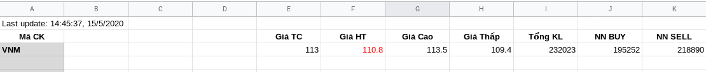

# Vietnamese Stock
Simple Google Apps Script to get Vietnamese Stock information such as *price*, *volume*

## How to setup
- Login to your google account
- Create a new blank google spread sheet at google drive, naming the sheet is *stocks*, format your sheet follow my demo image. Add **stocks symbol** which you care about, from **A3:A20**.
- In the Google Sheet UI, select **Tools > Script editor** to open the script bound to the sheet in the Apps Script editor.
- Write the macro function. Macro functions should take no arguments and return no values. Copy my `main.gs` content and patse to `marcro.gs` file.
- Save the script project. The macro is then available for use in the sheet.
- In the script function UI, select **Select Function** menu, select **main or setDataGoogleSheet** and run it.
- Check your google sheet :cheer:

## What's next?
- You can setup a [trigger](https://developers.google.com/apps-script/guides/triggers) for example to get stock price every minute.
- Whatever you want with your stock data.

## Current features
- Reload stock price periodically
- Send mail to receivers when prices change

## TODO